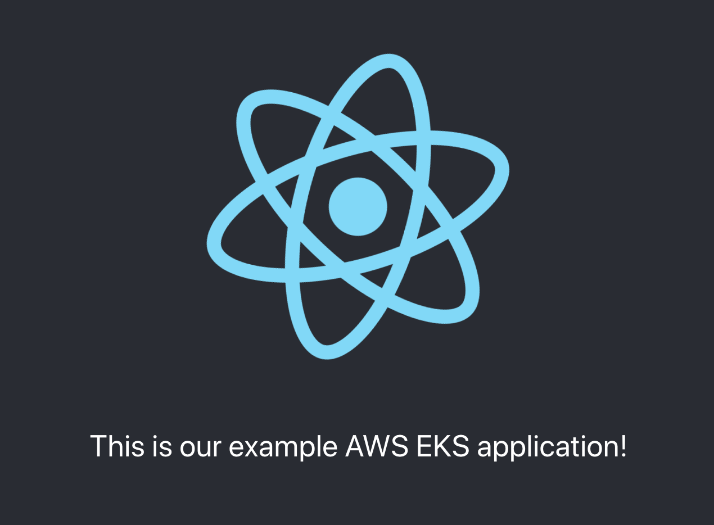

# Docker React App

This is a basic react app contained in Docker. It was designed to demonstrate using EKS to host Docker containers and is part of the wider Medium article [here](https://jc1175.medium.com/a-crash-course-in-kubernetes-1ccb70125ebf). 

It can be built and run using:

`docker-compose up --build`.

In order to display a simple React application as below.

There is also a `services.yaml` file which is used with EKS to deploy an image from `ECR` to a cluster and add a load balancer in front of it.

In order to zip the folder for pushing to `S3` or similar try `zip -r docker-react-app.zip .`